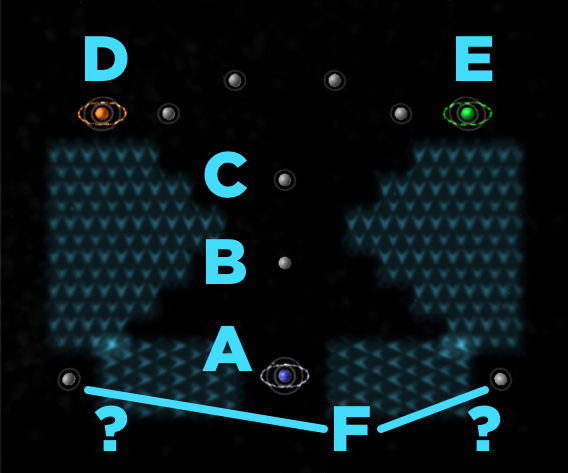

# Bootes - Shortcut

- Challenge: Force
- Level: Insane
- Nova Time: 5:45

# Strategy (by lgarron)

## Steps

1. Goal: A⇧L3. Repeat A↠A.
2. Goal: B⇧L1. Repeat A↠B.
3. Goal: C⇧L2. Repeat (all)↠C. (≈0:45 elapsed)
4. Goal: Hoard units on B. Repeat (all)↠B.
5. Goal: Lose A and C. Wait for other players to wipe them out. (≈1:30 elapsed)
6. Goal: D⇧3 and E⇧3. Split the units from B in half and send each one horizontally through the force field, then near their respective planets, and ambush. (≈2:00 elapsed)
7. Goal: Take the remaining 4 planets on top. Play like a normal game.
8. Goal: F⇧2. One of the other players should be beating the other. Take their side planet on the bottom. Repeat (all)↠F. (≈3:15 elapsed)
9. Goal: A⇧3. Repeat (all)↠A. (≈4:45 elapsed)
10. Goal: wipe out all other planets. You should have more than enough units for this.

## Stats

- Effort taken to beat NOVA time: ≈10 attempts
- Best time: 4:08.1

## Notes

- ⁴ I hoard all units on C until one of the other players attacks, then immediately move all units to B. This is intended to delay attacks from other players, though I don't know if it works.
- ⁸ You may need to target units to the far to the side. Targeting F directly loses units into the middle due to the force field.
