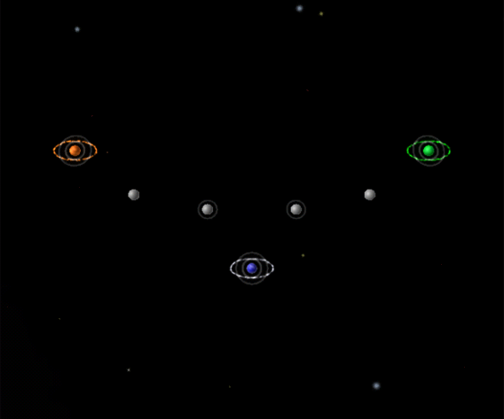

# Phoenix – Funnel

- Challenge: Fracture
- Level: Insane
- Nova Time: 4:30

# Strategy: Abandon Home (by lgarron)

- Effort taken to beat NOVA time: 1.5 hours of attempts.

## Planets

- A (max L3): Home Planet
- B (max L2): the planet north-east of A
- C (space): an arbitrary spot just south of A
- D (max L3): Orange's home planet (north-west)

## Steps

1. Goal: A⇧L2. A→A once.
2. Goal: B⇧L1. Repeat A→B.
3. Goal: A⇧L3. Repeat (all)→A.
4. Goal: Retreat to C. (all)→C
  - Other players will wipe out A and B. Don't heal them.
5. Goal: wipe out D. Move and hold all units near D, then strike once D send away units.
6. Goal: D⇧L3. Keep units around D, Wait until D un-fractures, and take it.
7. Goal: wipe out all other planets. Wait for one of the other players to get slightly ahead. Wipe out the planet belonging to them that is farthest from the middle, then keep picking off planets while keeping them fighting as much as possible.

## Notes

- ² B⇧L2 appears to cost more units than it produces before the other players wipe you out.
- ³ It's possible to pick a spot just south of A that allows units to be technically orbiting A, but constantly pulled back so that they aren't in the attack path for other players. I speculate that this might discourage other players from attacking A little longer, but I don't know for sure.
- ⁵ This will leave A with ∑L=3 and B with ∑L=4 for a while, so you might want to wait a little longer to let A build up more units. However, the imbalance from taking B earlier in the game usually eliminates the need to delay here.
- ⁶ The other players will take A and B, but this usually doesn't have a big impact on their ∑L balance.