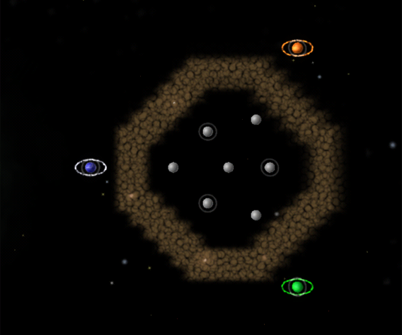

# Andromeda – Crater

- Challenge: Minefields
- Level: Hard
- Nova Time: 2:30

# Strategy (by lgarron)

- Effort taken to beat NOVA time: ≈20 attempts.

## Planets

- A (max L2): Home Planet
- B (max L1): Nearest planet inside crater.
- C (max L2): either max-L2 planet next to B.
- D (max L2): other max-L2 planet next to B.
- E (max L2): one of the other player's home planets (TBD).
- F (max L2): remaining player's home planet.

## Steps

1. Goal: A⇧L2. A→A once.
2. Goal: B⇧L1. Repeat A→B².
3. Goal: C⇧L1. Alternate A→B and B→C.
4. Goal: D⇧L1. Alternate A→B and (B+C)→D.
5. Goal: D⇧L2. Alternate A→B and (B+C+D)→D.
6. Goal: C⇧L2. Alternate A→B and (B+C+D)→C.
7. Goal: Defend C and D. Alternate B→C and B→D⁷.
  - You can send reinforcements A→B (and onto C/D) initially, but stop as soon as it seems Orange and Green can't take over C and D.
8. Goal: Wipe out E (but do not take it).
  - Choose E to be the home planet of whichever player appears to be doing better.
  - Send a little over 100 units A→E going *around* the minefield. Hold units next to E, wait for E to send reinforcements into the crater, and strike to wipe it out.
9. Goal: eliminate other players from the crater. Wipe out all planets inside the crater like a normal game.
10. Goal: Wipe out F. Send (all units)→F continuously.

## Notes

- ² Possible way to recuce minefield casualties in step 2: Try to sent units through the minefield as horizontally as possible, e.g. by selecting only the units on the east part of A.
- ⁷ Other players usually won't attack B.
- ⁹ Take over the first few planets in the crater. Don't take later planets if they won't produce more than 100 units before the end of the game. (TODO: I think this is ≈only the last planet, but need to measure that.)
