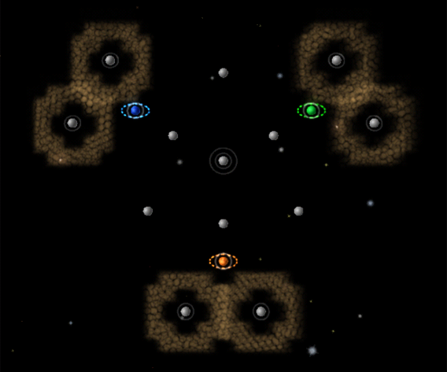

# Andromeda – Levies

- Challenge: Minefield
- Level: Hard
- Nova Time: 2:20

# Strategy: Take the Middle (by lgarron)

## Steps

1. Goal: Take over the middle. Take all planets on the middle, starting with the ones closes to you and ending with the other players' home planets.
2. Goal: Win. Wipe out the minefield-protected planets, one at a time.

## Stats

- Effort taken to beat NOVA time: 3 attempts.
- Best time: 2:11.21

## Notes

- ¹ Usually, only one of the players takes a new planet in the middle, the one opposite from my home planet.