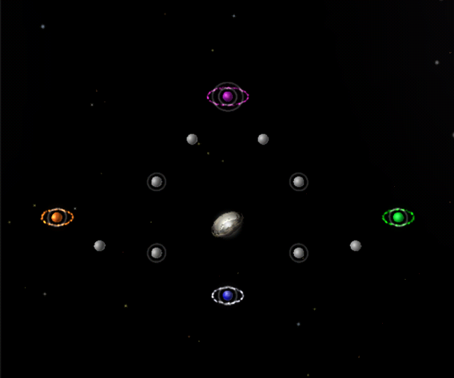

# Virgo - Bounty

- Challenge: White Holes
- Level: Insane
- Nova Time: 4:45

# Strategy (by lgarron)

- Effort taken to beat NOVA time: ≈20 attempts.

## Planets

- A (max L2): Home Planet
- B (max L2): WNW of A
- C (max L1): West of B
- D (max L2): Orange starting planet, W of C
- E (max L2): North of B
- F (white hole)

## Steps

1. Goal: A⇧L2. A→A once.
2. Goal: C⇧L1. Repeat A↠C.
3. Goal: B⇧L2. Repeat (all)↠B.
4. Goal: D⇧L2. This is tricky. Hoard units on C and strike a surprise attack when it D is low on units.
5. Goal: E⇧L2.
6. Goal: Claim F.
7. Goal: Win. Take over big planets going around.

## Stats

- Effort taken to beat NOVA time: 3 attempts
- Best time: 2:31.60
